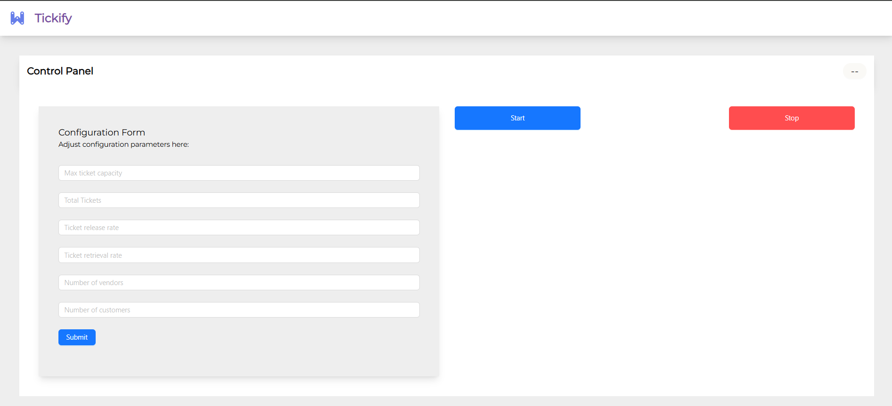
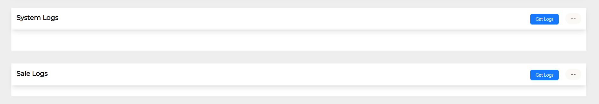
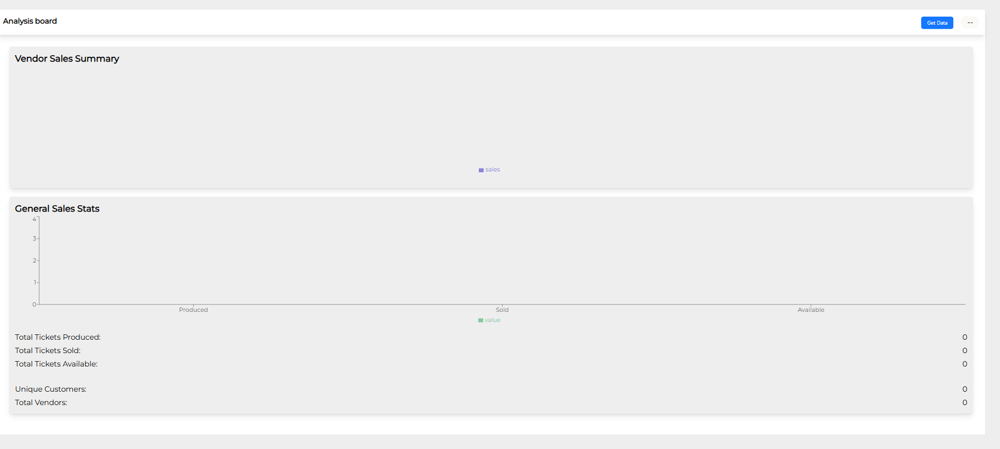
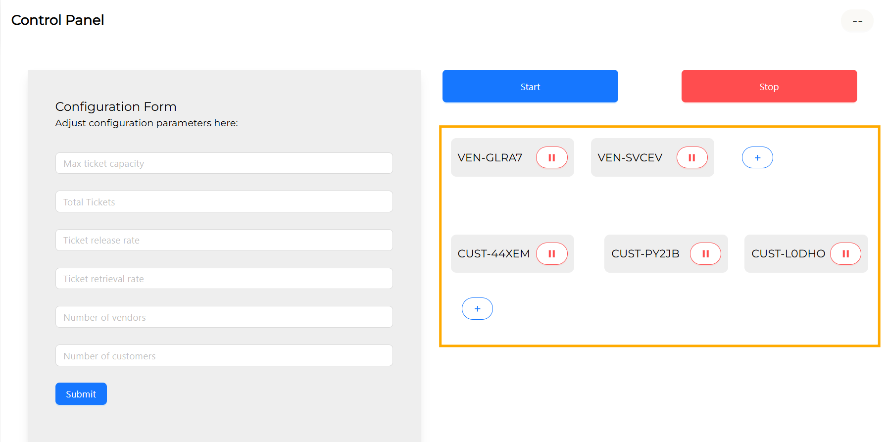

# Ticket Management Simulation System

This system simulates a ticket-purchasing environment where **vendors** add tickets to a shared `TicketPool`, and **customers** retrieve tickets from the pool. It is designed to handle concurrent operations, ensuring proper synchronization and interaction between vendors, customers, and the ticket pool.

## Prerequisites 

1. JDK 21 or higher
2. Node v20.18.0 or higher

## How to Run The Main Project

1.  Clone the repository.

    `git clone https://github.com/Deeshon/oop-cw.git`

2. Move into the oop-cw directory

   `cd oop-cw`

3. Compile the project.

    `mvn clean install`

4. Move into the cli directory and compile the project

    `cd cli`
    
   `mvn clean install`

5. Move into the backend directory and compile the project

    `cd ..`

   `cd backend`
   
   `mvn clean install`

5.  Run the project:

    `mvn spring-boot:run`

6. Move into the frontend directory

    `cd ..`

    `cd frontend`

7. Install the node dependencies

    `npm install`

8. Run the frontend

    `npm run dev`

9. Open `http://localhost:3001` in your browser to access the frontend.

Once both the backend and the frontend is running, the user can continue along with the GUI. 

In the GUI the user can see several sections, among them the first concern should be the Control Panel which hold the Configuration form to set configuration parameters for the simulation.

Once the configuration params are set and submitted, the user can start the simulation.

Below the Control Panel the user can see three more sections, the System Logs Panel, Sales Logs Panel and the Analysis Board. 

The System Logs Panel will periodically poll the system logs as the simulation run. These logs will include all logs shown in the cli.

The Sales Logs Panel will periodically poll the sales occuring in the simulation.

The Analysis Board will show specific data of the simulation through charts and simple listing for further clarity on the operations of the simulation,

The above highlighted section displays the currently active vendors and the customer in the system. Using the given control the user can either add new vendors/customers or remove them.

The user can click on the Stop Button to stop the simulation and clear all data.

## How to Run The CLI-Only Version

1. Follow the previous steps from step 1 to step 4

    `run cli`

    
Once the programs starts running, it'll first prompt to select either to enter configurations or use an existing configuration (if present). 

If selected to enter configurations, the program will prompt the user to enter the 4 main parameters:- Max ticket capacity, total tickets, ticket release rate, ticket retrieval rate.

Once these params are set, the simulation will start.

**Refer to [DOCS.md](./DOCS.md) if a detailed overview of the system if required.**

